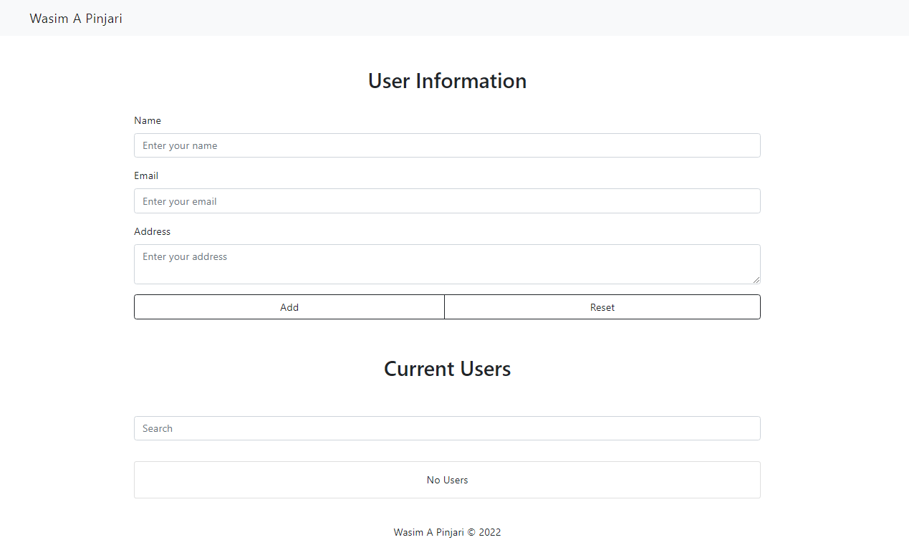
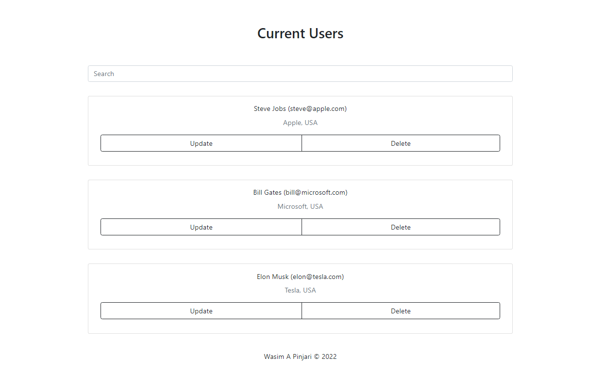
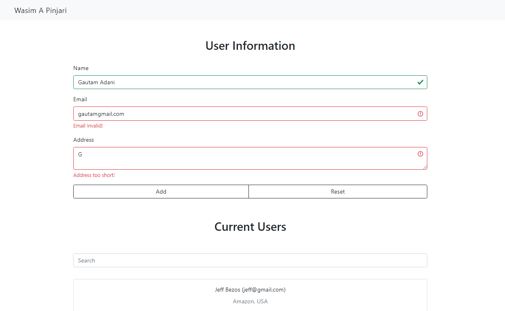
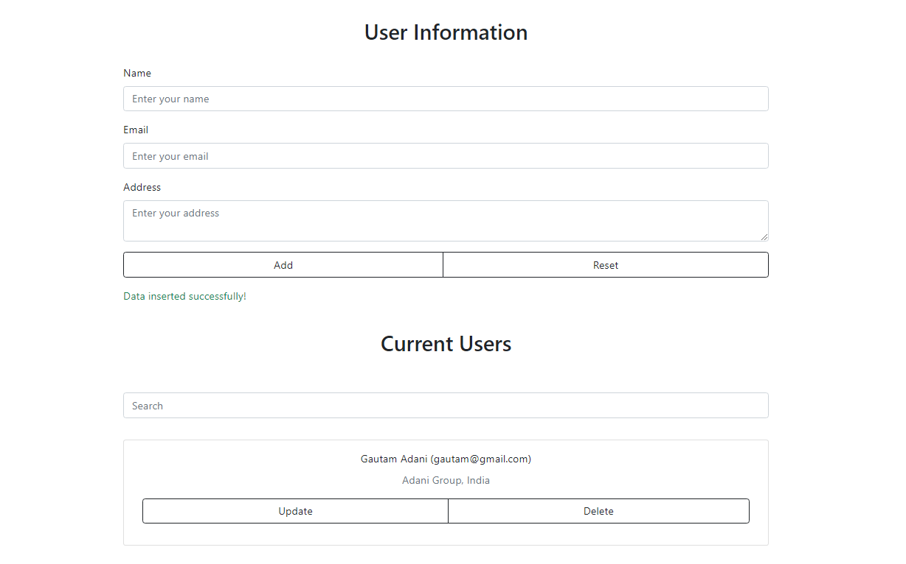

<!-------------------------------------------------------------------------------

ajax-crud: readme.md
Licensed under MIT (https://github.com/wasimapinjari/ajax-crud/blob/main/LICENSE)

-------------------------------------------------------------------------------->

# ajax-crud

## AJAX CRUD Application with Client-side JavaScript and Server-side PHP Validation
___
### PREVIEW 😋
___

___

___

___

___
### IMPORTANT! 😅
___
If program does not work properly as expected just refresh the page. Sometimes your browser may take time to download Bootstrap and jQuery files using internet.
___
### Windows Installation 😎
___

Steps | What to do?
|-|-
| Step 1: | Download and install [XAMPP](https://www.apachefriends.org/download.html)
| Step 2: | Open XAMPP
| Step 3: | Start Apache & MySQL Module
| Step 4: | Locate htdocs folder inside xammp folder (default installation directory is: C:\xampp\htdocs)
| Step 5: | Copy "ajax-crud-main" named folder inside ajax-crud-main.zip and paste it inside htdocs folder
| Step 6: | Open browser, enter and search "localhost/ajax-crud-main/index.php"
| Step 7: | Enjoy!
___
### Why Validate Twice? 🙄
___
Client-side validation may seem useless, but it helps in reducing load on server. And server-side validation keeps hackers away who may bypass client-side validation.
___
### Prerequisites 🙃
___
If you want to modify this code you may need to have knowledge of HTML, CSS, Bootstrap, JavaScript, jQuery, AJAX, PHP, MySQL and XAMPP.
___
### Notes (Wikipedia links): 🧐
___
* [AJAX](https://en.wikipedia.org/wiki/Ajax_(programming)) 
* [CRUD](https://en.wikipedia.org/wiki/Create,_read,_update_and_delete) 
* [Data Validation](https://en.wikipedia.org/wiki/Data_validation)
* [XAMPP](https://en.wikipedia.org/wiki/XAMPP)
